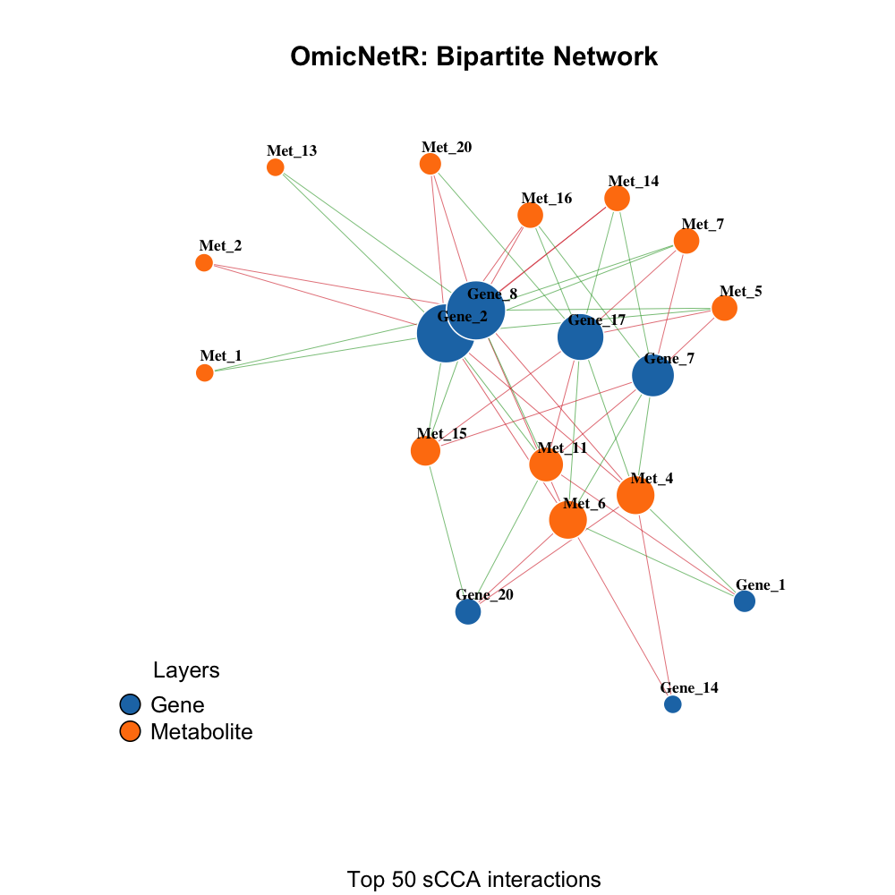
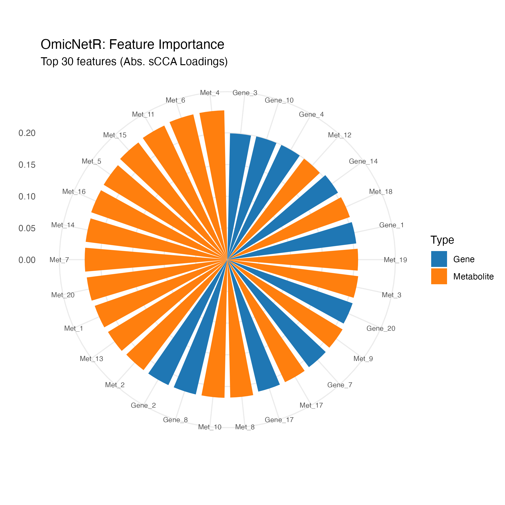
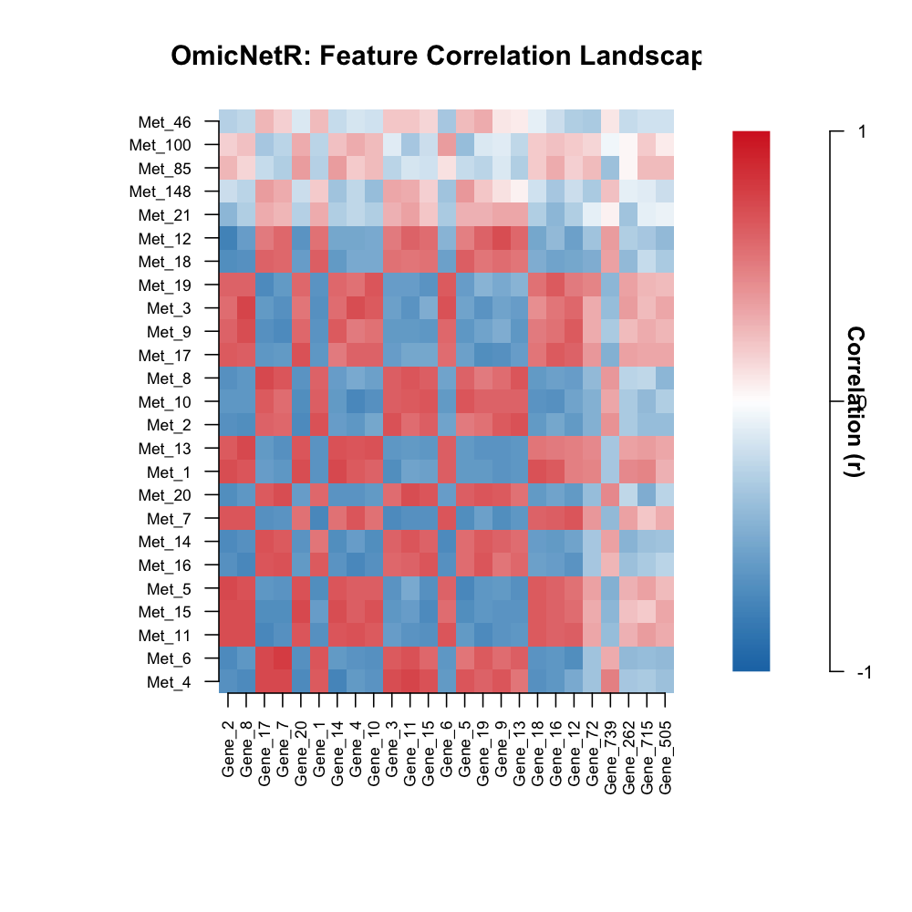

- [OmicNetR](#omicnetr)
  - [Installation](#installation)
  - [Quick start](#quick-start)
  - [Figures](#figures)
  - [Included example dataset](#included-example-dataset)
  - [Main functions](#main-functions)
  - [Code of conduct](#code-of-conduct)

<!-- README.md is generated from README.Rmd. Please edit README.Rmd, then run:
     tools/render_readme.R  (recommended)  or  rmarkdown::render("README.Rmd")
-->

<!-- badges: start -->

[](https://github.com/ppchaudhary/OmicNetR/actions/workflows/R-CMD-check.yaml)
<!--
Uncomment AFTER the package is on CRAN (otherwise it will show as "not found").
[](https://CRAN.R-project.org/package=OmicNetR)
--> <!-- badges: end -->

# OmicNetR

**OmicNetR** is an R package for integrative multi-omics analysis using
**Sparse Canonical Correlation Analysis (sCCA)**. It supports an
end-to-end workflow for aligning multi-omics datasets, fitting an sCCA
model, creating a gene–metabolite bipartite network, and generating
summary visualizations.

## Installation

### Development version (GitHub)

``` r
install.packages("devtools")
devtools::install_github("ppchaudhary/OmicNetR")
```

``` r
library(OmicNetR)
```

## Quick start

``` r
set.seed(123)

omics_data <- generate_dummy_omics(
  n_samples = 60,
  n_genes = 800,
  n_metabolites = 150,
  n_linked = 20
)

X <- omics_data$X
Y <- omics_data$Y

aligned <- align_omics(X, Y)
```

    ## Successfully aligned 60 matching samples.

``` r
scca_model <- omic_scca(
  X = aligned$X,
  Y = aligned$Y,
  n_components = 2,
  penalty_X = 0.70,
  penalty_Y = 0.70
)
```

    ## Model Optimization: Keeping 240 genes and 45 metabolites.

``` r
net_data <- scca_to_network(
  scca_model,
  comp_select = 1,
  weight_threshold = 0.01
)

# Keep top edges for a cleaner plot
net_data <- net_data[order(abs(net_data$Weight_Product), decreasing = TRUE), ]
net_data <- head(net_data, 50)
```

## Figures

The script `tools/render_readme.R` will (1) generate figures into
`man/figures/` and (2) render `README.md`. If you already generated
figures, the blocks below will display them in GitHub.

### Bipartite gene–metabolite network



### Feature importance circle plot



### Gene–metabolite correlation heatmap



## Included example dataset

``` r
data(omics_example)
str(omics_example, max.level = 1)
```

    ## List of 3
    ##  $ X       : num [1:50, 1:200] -1.6301 0.0816 -0.0224 -0.588 0.5384 ...
    ##   ..- attr(*, "dimnames")=List of 2
    ##   ..- attr(*, "scaled:center")= Named num [1:200] -0.0411 0.3266 -0.1829 0.015 -0.3237 ...
    ##   .. ..- attr(*, "names")= chr [1:200] "Gene_1" "Gene_2" "Gene_3" "Gene_4" ...
    ##   ..- attr(*, "scaled:scale")= Named num [1:200] 2.03 1.68 2.28 1.91 2.14 ...
    ##   .. ..- attr(*, "names")= chr [1:200] "Gene_1" "Gene_2" "Gene_3" "Gene_4" ...
    ##  $ Y       : num [1:50, 1:50] 0.279 -0.754 -1.271 1.383 0.084 ...
    ##   ..- attr(*, "dimnames")=List of 2
    ##   ..- attr(*, "scaled:center")= Named num [1:50] -0.1551 -0.1521 0.2014 -0.0142 0.2227 ...
    ##   .. ..- attr(*, "names")= chr [1:50] "Met_1" "Met_2" "Met_3" "Met_4" ...
    ##   ..- attr(*, "scaled:scale")= Named num [1:50] 2.39 2.27 2.26 2.38 2.24 ...
    ##   .. ..- attr(*, "names")= chr [1:50] "Met_1" "Met_2" "Met_3" "Met_4" ...
    ##  $ metadata:'data.frame':    50 obs. of  3 variables:

> Note: `omics_example` is simulated and intended for demonstration
> only.

## Main functions

- `generate_dummy_omics()` – generate linked synthetic multi-omics
  data  
- `align_omics()` – align datasets by sample names  
- `omic_scca()` – perform sparse canonical correlation analysis  
- `scca_to_network()` – convert sCCA loadings to network edges  
- `plot_bipartite_network()` – visualize gene–metabolite networks  
- `plot_pathway_circle()` – feature importance radial plot  
- `plot_correlation_heatmap()` – global correlation heatmap

## Code of conduct

Please note that the OmicNetR project is released with a Contributor
Code of Conduct. By contributing to this project, you agree to abide by
its terms.
